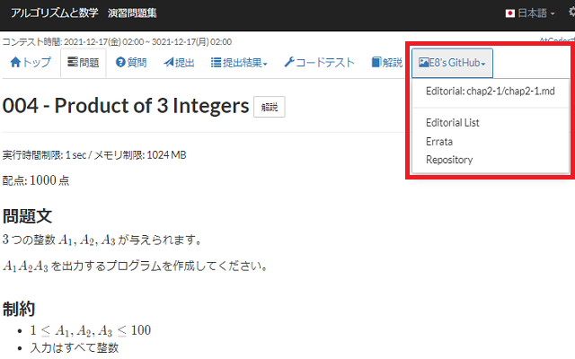

# atcoder-math-and-algorithm-extension

AtCoderの問題「[アルゴリズムと数学　演習問題集](https://atcoder.jp/contests/math-and-algorithm/tasks)」の節末問題の解説リンクを追加します。

# Install

[Chrome Web Storeからインストール](https://chrome.google.com/webstore/detail/atcoder-math-and-algorith/jpdmohcbpngfckbndmibeokobcfilend)してください：

# For Devs

開発者用のドキュメントは[ここ](README_devs.md)を見てください。
